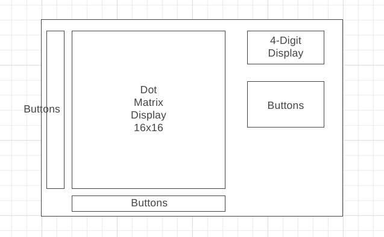

# USB Host MIDI Sequencer

(project description tba)

## Device layout

## BOM

| Material                   | Pieces | Shop Links |
|----------------------------|--------|------------|
| Arduino-compatible MCU     | 1      |            |
| USB Host Shield            | 1      |            |
| WS2812B 16x16 LED matrix   | 1      |            |
| TM1637 4-digit LED display | 1      |            |
| Buttons                    | ?      |            |
| Encoders                   | ?      |            |
